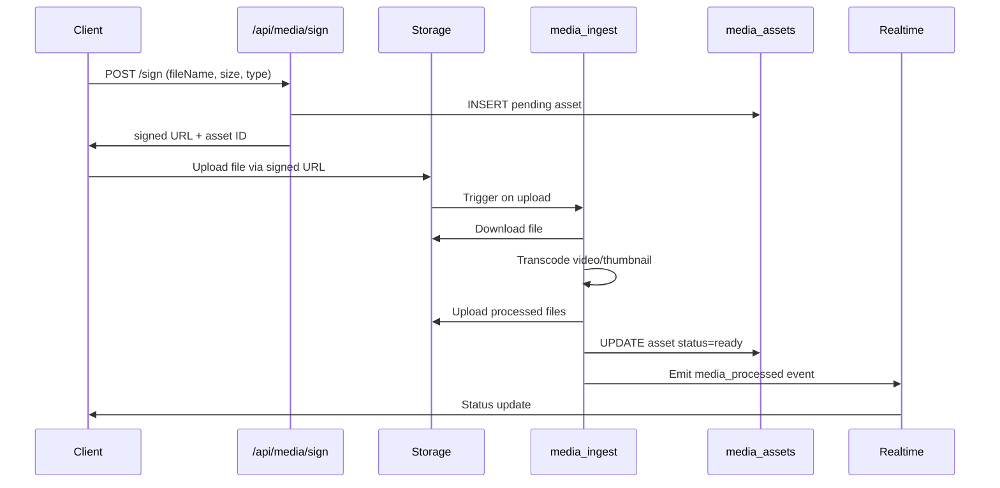

# Media Pipeline Operations

## Overview

The media pipeline handles upload, processing, and storage of media assets (videos and images) for the CaterKing platform. It ensures secure, efficient processing with real-time status updates and operational monitoring.

## Architecture

### Components

1. **API Route** (`/api/media/sign`): Issues signed upload URLs and creates pending media asset records
2. **Supabase Storage**: Stores raw uploaded files in company-partitioned buckets
3. **Edge Function** (`media_ingest`): Processes uploads, transcodes videos, generates thumbnails
4. **Database** (`media_assets` table): Tracks asset metadata and processing status
5. **Queue Watcher** (`scripts/media/watch_queue.ts`): Monitors backlog and alerts operations

### Data Flow



## Processing Pipeline

### Upload Phase

- Client requests signed URL from `/api/media/sign`
- Validates file size (<500MB), MIME type, user permissions
- Creates `media_assets` record with `status: 'pending'`
- Returns signed URL scoped to company bucket

### Processing Phase

- Storage upload triggers `media_ingest` Edge Function
- Downloads file from storage
- For videos: Transcodes to H.264/AAC, generates JPEG thumbnail
- For images: Generates thumbnail
- Updates `media_assets` with processed URLs, duration, `status: 'ready'`
- Emits realtime event for UI updates

### Monitoring Phase

- Queue watcher runs every 60 seconds
- Counts pending/processing assets
- Alerts if backlog > 10 items
- Logs oldest items for triage

## Error Handling

### Common Errors

- **Invalid file type**: Rejected at sign API with 400
- **File too large**: Rejected at sign API with 400
- **Upload failure**: Signed URL expires in 1 hour; client retries
- **Processing failure**: Asset status set to 'failed'; manual retry required
- **Storage quota**: Function logs error; ops alerted via watcher

### Recovery Procedures

1. **Stuck processing**: Check Edge Function logs; restart if needed
2. **Failed uploads**: Client gets new signed URL; old pending record cleaned up
3. **Backlog buildup**: Scale Edge Function concurrency or investigate bottlenecks
4. **Storage issues**: Check Supabase dashboard; contact support if quota exceeded

## Operations

### Running the Watcher

```bash
# From project root
tsx scripts/media/watch_queue.ts
```

### Monitoring Logs

- Edge Function logs: Supabase Dashboard > Edge Functions
- API logs: Vercel logs for admin-crm app
- Watcher logs: Console output when running script

### Cleanup Jobs

- Old assets (>1 year) deleted via cron job (not implemented yet)
- Failed assets reviewed monthly for manual cleanup
- Thumbnails retained alongside originals

### Alerts

- Backlog > 10: Log ALERT message
- Processing failures: Function logs error
- Escalate to ops if backlog persists >1 hour

## Security

- Signed URLs expire in 1 hour
- Storage paths prefixed with company_id
- RLS policies enforce company isolation
- Service role key used for internal operations only

## Performance

- Max file size: 500MB
- Expected processing time: <5 minutes for videos
- Thumbnail size: 320x240px
- CDN caching: 1 hour for processed assets

## Future Enhancements

- Video streaming with HLS/DASH
- Advanced transcoding options (resolutions, codecs)
- Batch processing for multiple files
- Integration with external CDNs
- Automated cleanup policies
